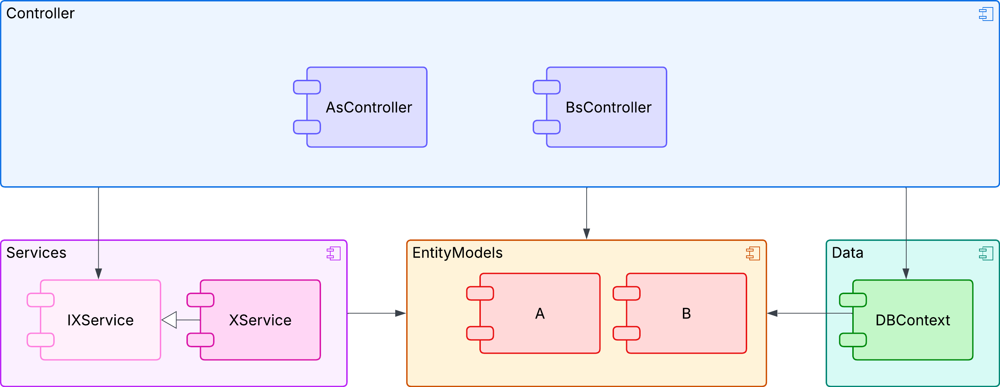
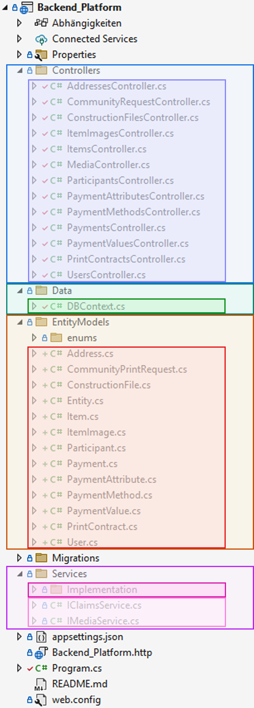
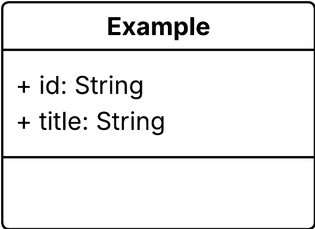

# reconstructit backend

This backend was developed as part of a bachelor’s project to demonstrate the concept of
Reconstructit. The app aims to make repairing everyday objects more accessible and sustainable by
 users to generate 3D models of missing or broken parts from photos. These models can either
be 3D-printed directly or requested from the community.

This backend is already deployed but there are some features missing. A description of next steps as well as already implemented features can be found in the projects submission file.

There is a video of the current state of the application available on [YouTube](https://www.youtube.com/watch?v=U8foj0fZ1Xc).

## Run the Backend

To execute the backend locally, ensure that you have C# with .NET installed in your system.
For the IDE, I chose Visual Studio even though JetBrains Rider seems to be a good alternative, especially for Mac users.
This Application uses .NET 8.

Follow the official [.NET installation guide](https://dotnet.microsoft.com/en-us/download#:~:text=Install%20the%20C%23%20Dev%20Kit%20to%20get%20the,developer%20packs%20for%20.NET%20Framework%2C%20.NET%2C%20and%20ASP.NET.) to
set up your development environment.

To run the code locally, some system environment variables have to be set in your system.
To get the values of the deployed system's connection strings, you have to be part of the [RG-ETCE.Reconstructit resource group](https://portal.azure.com/#@rg-dgt.de/resource/subscriptions/bce4d17a-6c3b-47c2-b068-7fc5a776a2c1/resourceGroups/RG-ETCE.Reconstructit/overview)

Database:
Add ``CUSTOMCONNSTR_reconstructitDatabase`` as a variable to your systemvariables and paste the connection string from azure as the value.
You can find the connection string when navigating to the ["Verbindungszeichenfolgen" of the SQL.Database instance on Azure ](https://portal.azure.com/#@rg-dgt.de/resource/subscriptions/bce4d17a-6c3b-47c2-b068-7fc5a776a2c1/resourceGroups/RG-ETCE.Reconstructit/providers/Microsoft.Sql/servers/dbserverreconstructit/databases/reconstructit_database/connectionStrings).
Then copy the ASO.NET (SQL-Authentifizierung) String. You have to add the password there. You can find the password in the appendix B of the projects submission file.

In addition to the connection string, you have to add your IP Address to the [firewall rules](https://portal.azure.com/#@rg-dgt.de/resource/subscriptions/bce4d17a-6c3b-47c2-b068-7fc5a776a2c1/resourceGroups/RG-ETCE.Reconstructit/providers/Microsoft.Sql/servers/dbserverreconstructit/networking) of the database's SQL-Server. You can get there by navigating to "Server-Firewall festlegen" on the SQL-Database instance on Azure.

Blob storage:
The blob storage is used for the storage of images and .stl files. 
Add ``CUSTOMCONNSTR_reconstructitBlob`` as a variable to your systemvariables and paste the connection string from azure as the value.
You can find the connection string when navigating to [the "zugriffsschlüssel" of the blobstoragereconstructit ](https://portal.azure.com/#@rg-dgt.de/resource/subscriptions/bce4d17a-6c3b-47c2-b068-7fc5a776a2c1/resourceGroups/RG-ETCE.Reconstructit/providers/Microsoft.Storage/storageAccounts/blobstoragereconstructit/keys).
Then use the key 1 Verbindungszeichenfolge String. 


Once the environment is ready, you can press play (with https) in your IDE to start the backend locally.

## Deployment

The backend is currently deployed with azure App services.
You can find the service [here](https://portal.azure.com/#@rg-dgt.de/resource/subscriptions/bce4d17a-6c3b-47c2-b068-7fc5a776a2c1/resourceGroups/RG-ETCE.Reconstructit/providers/Microsoft.Web/sites/reconstructitBackend/appServices).
The [connections strings](https://portal.azure.com/#@rg-dgt.de/resource/subscriptions/bce4d17a-6c3b-47c2-b068-7fc5a776a2c1/resourceGroups/RG-ETCE.Reconstructit/providers/Microsoft.Web/sites/reconstructitBackend/connectionStrings) are already defined in this service.
There is no deployment pipeline yet so you have to deploy the backend to this service from your local machine e.g. with Visual Studio. 
Your backend will then be available at https://reconstructitbackend-b8dcdscua2bcfxdf.northeurope-01.azurewebsites.net/. It will also generate the [Swagger](https://reconstructitbackend-b8dcdscua2bcfxdf.northeurope-01.azurewebsites.net/swagger/index.html)]

## Backend Architecture

This project is built with a very simple architecture.



The Architectual Overview shows that there are four primary components/layers:

1. Controller
2. Services
3. Entity Models
4. Data

Those layers and their components are explained in the following sections. 
The layer - folder assignment is described with colors here.



### Entity Models

In this project, the entity models are derived from the domain model. As an example, we use the
Example Entity.



Now, we create an Example Entity-Model in the entity_models folder.

To do this, we define a class and add the required attributes. The Example entity model will look as
follows:

```C#
namespace Backend_Platform.Entities
{
    public class Example
    {
        public Guid Id { get; set; }
        public string Title { get; set; }
    }
}
```
### Data

In the Data Layer there is the DBContext. Create a DBSet (Table) for every EntityModel you need in the Database here.

In our case, we should add the following line:

```c#
 public DbSet<Example> Examples { get; set; }
```

Every time you add a DbSet to the Context or edit an entity model registered here, you should migrate your database.
To do this, go to Ansicht -> weitere fenster -> Paketmanagerkonsole in Visual Studio.
Here you can create a migration at first

```bash
Add-Migration migration_name
```
It is always worth checking the migration and seeing what changed before you lose data wenn appplying it.
And then apply the migration to the database like this:

```bash
Update-Database
```

Keep in  mind, that you have to configure the firewall of the SQL Server to do this as decribed in the Run the Backend chapter.

### Services

In this backend, we differentiate between services as interfaces and their implementations.
Services and their methods are used for any kind of operation that is not a simple database operation and the interface can be called by any Controller.

You have to inject your implementation into your interface. This needs to be done in the ``Program.cs``.
Imagine you have an IExampleService.cs and a ExampleService.cs for the Implementation. Add this line before you call ``var app = builder.Build();``:


``` cs
builder.Services.AddSingleton<IExampleService, ExampleService>();
```

### Controller

Controllers provide the REST API. To every Entity there is a Controller.
Accordingly we would have an ExamplesController in our Example application.
You can define your endpoints in this class.
Since we cannot have an id in the body of the POST request, we create records for this.

A controller with one POST Request for the Example could look like this:

```cs
namespace WebApplication1.Controllers
{
    [Authorize]
    [Route("api/[controller]")]
    [ApiController]
    public class ExamplesController : ControllerBase
    {
        private readonly DBContext _context;
        public ExamplesController(DBContext context)
        {
            _context = context;
        }


        // POST: api/Examples
        [HttpPost]
        public async Task<ActionResult<Example>> PostExample(ExamplesRecords.CreateExampleRecord exampleRecord)
        {

            var example = new Example(){
                Title = exampleRecord.Title
            };
            _context.Examples.Add(example);

            await _context.SaveChangesAsync();
        

            return CreatedAtAction(nameof(GetExamples), new {example.Id}, example);
        }
    }
    public class ExamplesRecords
    {
        public record CreateExampleRecord(string Title);

    }
}

```

You can also notice the ``[Authorize]`` annotation above the controller. This means the authentication defined in the ``program.cs`` will be applied here. If you want an not protected controller, remove this annotation. 